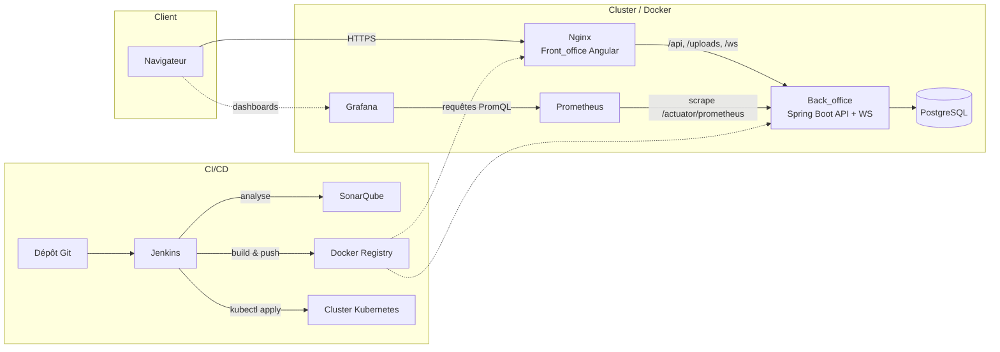

<p align="center">
  
</p>

<h1 align="center">Plateforme de Demandes Internes — STB Bank</h1>

<p align="center">
  Application interne de gestion des demandes (développement, correction de bug, accès, maintenance, évolution, assistance)
  entre demandeurs, développeurs, chefs de projet et administrateurs.
</p>

<p align="center">
  
  
  
  
  
  
  
</p>

---

## Sommaire

- [Aperçu](#aperçu)
- [Architecture](#architecture)
- [Stack technique](#stack-technique)
- [Structure du dépôt](#structure-du-dépôt)
- [Démarrage rapide en local (IDE)](#démarrage-rapide-en-local-ide)
- [Démarrage avec Docker Compose](#démarrage-avec-docker-compose)
- [Comptes de démonstration](#comptes-de-démonstration)
- [Qualité de code — SonarQube](#qualité-de-code--sonarqube)
- [Intégration & déploiement continus — Jenkins](#intégration--déploiement-continus--jenkins)
- [Déploiement Kubernetes](#déploiement-kubernetes)
- [Supervision — Prometheus & Grafana](#supervision--prometheus--grafana)
- [Variables d'environnement](#variables-denvironnement)

## Aperçu

La plateforme permet à un **demandeur** de soumettre une demande (bug, accès, évolution, assistance...), à un
**chef de projet** de l'affecter à un **développeur**, et à ce dernier de la traiter jusqu'à sa clôture, avec
historique de statuts, pièces jointes, notifications temps réel (WebSocket) et tableau de bord statistiques.
Un rôle **administrateur** gère les comptes utilisateurs.

- **Back_office** : API REST Spring Boot (Java 21), sécurisée par JWT, PostgreSQL.
- **Front_office** : SPA Angular (thème *Gradient Able*), consomme l'API REST et les notifications WebSocket.

## Architecture



En production, le conteneur Nginx du frontend sert le bundle Angular **et** proxifie les
routes `/api`, `/uploads` et `/ws` vers le backend (voir
[`nginx.conf.template`](Front_office/template_STB/angular/nginx.conf.template)) : le navigateur ne parle
qu'à une seule origine, ce qui évite les soucis de CORS et fonctionne aussi bien derrière
Docker Compose que derrière un Ingress Kubernetes.

## Stack technique

| Domaine | Technologies |
|---|---|
| Backend | Spring Boot 4.1, Spring Security (JWT), Spring Data JPA, WebSocket, Maven |
| Frontend | Angular 21, Bootstrap 5, ApexCharts |
| Base de données | PostgreSQL 16 |
| Conteneurisation | Docker, Docker Compose, Nginx |
| CI/CD | Jenkins (pipeline déclaratif) |
| Qualité de code | SonarQube, JaCoCo (couverture backend) |
| Orchestration | Kubernetes (Deployments, StatefulSet, HPA, Ingress) |
| Supervision | Spring Boot Actuator, Micrometer, Prometheus, Grafana |

## Structure du dépôt

```
STB_BANK/
├── Back_office/                 # API Spring Boot
│   ├── src/
│   ├── Dockerfile
│   └── pom.xml
├── Front_office/template_STB/angular/   # SPA Angular
│   ├── src/
│   ├── Dockerfile
│   └── nginx.conf.template
├── docker-compose.yml           # Stack applicative locale (db, backend, frontend, prometheus, grafana)
├── devops/jenkins/docker-compose.ci.yml  # Infra CI locale (Jenkins + SonarQube)
├── Jenkinsfile                  # Pipeline CI/CD
├── k8s/                         # Manifestes Kubernetes
│   ├── namespace.yaml, postgres.yaml, backend.yaml, frontend.yaml, ingress.yaml
│   ├── secret.example.yaml      # Gabarit — copier en secret.yaml (non versionné)
│   └── monitoring/servicemonitor.yaml
├── monitoring/                  # Config Prometheus + provisioning Grafana (Docker Compose)
└── .env.example                 # Gabarit de configuration Docker Compose
```

## Démarrage rapide en local (IDE)

C'est le flux de travail habituel pour développer :

1. **PostgreSQL** : instance locale sur le port `5434`, base `stb_bank` (voir
   [`application.properties`](Back_office/src/main/resources/application.properties) pour les identifiants par défaut).
2. **Backend** : ouvrir `Back_office/` dans l'IDE (IntelliJ...) et lancer `Back_officeApplication`.
   Démarre sur `http://localhost:8080` et peuple la base avec un jeu de données de démonstration
   au premier lancement (voir [comptes de démonstration](#comptes-de-démonstration)).
3. **Frontend** :
   ```bash
   cd Front_office/template_STB/angular
   npm install
   npm start   # ng serve — http://localhost:4200, appelle directement http://localhost:8080/api
   ```

## Démarrage avec Docker Compose

Pour lancer toute la stack (PostgreSQL, backend, frontend servi par Nginx, Prometheus, Grafana)
sans rien installer d'autre que Docker :

```bash
cp .env.example .env
# éditer .env : POSTGRES_PASSWORD, JWT_SECRET, GRAFANA_ADMIN_PASSWORD...
docker compose up -d --build
```

| Service | URL |
|---|---|
| Frontend | http://localhost:4200 |
| Backend (API) | http://localhost:8080/api |
| Backend (santé) | http://localhost:8080/actuator/health |
| Prometheus | http://localhost:9090 |
| Grafana | http://localhost:3000 (identifiants dans `.env`) |

Arrêt : `docker compose down` (ajouter `-v` pour supprimer aussi les volumes/données).

## Comptes de démonstration

Injectés automatiquement au premier démarrage si la base est vide (voir
[`DataLoader`](Back_office/src/main/java/tn/esprit/stb/back_office/config/)) — mot de passe commun `Password123` :

| Rôle | Email |
|---|---|
| Administrateur | admin@stb.tn |
| Chef de projet | chef@stb.tn |
| Développeur | dev1@stb.tn / dev2@stb.tn |
| Demandeur | demandeur@stb.tn / demandeur2@stb.tn |

## Qualité de code — SonarQube

Deux projets sont analysés séparément :

- **Back_office** (Maven) — couverture de tests via JaCoCo, exécuté par le Jenkinsfile :
  ```bash
  ./mvnw sonar:sonar -Dsonar.host.url=http://localhost:9000 -Dsonar.token=<votre-jeton>
  ```
- **Front_office/angular** (sonar-scanner CLI), configuration dans
  [`sonar-project.properties`](Front_office/template_STB/angular/sonar-project.properties).

Pour lancer un SonarQube local : `cd devops/jenkins && docker compose -f docker-compose.ci.yml up -d sonarqube sonarqube-db`,
puis ouvrir http://localhost:9000 (identifiants par défaut `admin` / `admin`, à changer immédiatement).

## Intégration & déploiement continus — Jenkins

Le [`Jenkinsfile`](Jenkinsfile) définit un pipeline déclaratif :

```
Checkout → Build+Tests backend → Analyse SonarQube backend*
         → Build frontend → Analyse SonarQube frontend*
         → Build images Docker → Push registre (branche main)*
         → Déploiement Kubernetes (branche main)*
```
*étapes protégées par `catchError` : si le credential/l'outil correspondant n'est pas encore
configuré, le build passe en `UNSTABLE` au lieu d'échouer — le pipeline peut tourner de bout
en bout dès le premier jour, la configuration se complète progressivement.

L'analyse SonarQube appelle directement l'API Sonar avec un jeton (pas de configuration
globale "SonarQube servers" à faire dans Jenkins), donc pas de dépendance à un webhook ni à
un outil `SonarScanner` déclaré séparément.

**Lancer Jenkins en local :**
```bash
cd devops/jenkins
docker compose -f docker-compose.ci.yml up -d
```
Jenkins est alors disponible sur http://localhost:8081 (le port 8080 est réservé au backend).

**Configuration Jenkins requise** (détaillée en tête du `Jenkinsfile`) :
- Plugins : Pipeline, Docker Pipeline, Git, JUnit.
- `mvn`/`java` (via `./mvnw`), `node`/`npm`, `sonar-scanner`, `docker` et `kubectl` disponibles
  sur l'agent Jenkins.
- Credentials `sonarqube-token` (Secret text) : jeton généré dans SonarQube
  (Mon compte → Security → Generate Tokens) — à créer une fois, à la main, dans Jenkins.
- Credentials `docker-hub-creds` (utilisateur/mot de passe) pour pousser les images vers le
  namespace Docker Hub configuré dans `DOCKERHUB_NAMESPACE` (Jenkinsfile).
- kubectl utilise le kubeconfig par défaut de l'utilisateur Jenkins (`~/.kube/config`) ; si
  absent, l'étape de déploiement est simplement ignorée (`UNSTABLE`, pas `FAILURE`).
- Un job de type *Pipeline* avec définition **"Pipeline script from SCM"** (Git) pointant vers
  ce dépôt, branche `main`, script path `Jenkinsfile`.

## Déploiement Kubernetes

```bash
kubectl apply -f k8s/namespace.yaml
cp k8s/secret.example.yaml k8s/secret.yaml   # éditer les vraies valeurs — fichier non versionné
kubectl apply -f k8s/secret.yaml
kubectl apply -f k8s/ -n stb-bank
```

Contenu de `k8s/` :

| Fichier | Rôle |
|---|---|
| `namespace.yaml` | Namespace `stb-bank` |
| `postgres.yaml` | StatefulSet + Service headless + PVC (2Gi) |
| `backend.yaml` | Deployment (2 réplicas), Service, ConfigMap, PVC uploads, HPA (CPU 70%), probes `/actuator/health` |
| `frontend.yaml` | Deployment (2 réplicas) + Service (Nginx) |
| `ingress.yaml` | Ingress (ingress-nginx) — un seul host, tout passe par le frontend qui proxifie `/api`, `/uploads`, `/ws` |
| `monitoring/servicemonitor.yaml` | `ServiceMonitor` pour kube-prometheus-stack (Prometheus Operator) |

Le déploiement continu (Jenkinsfile) applique ces manifestes puis fait un
`kubectl set image` avec le tag de build, suivi d'un `kubectl rollout status`.

## Supervision — Prometheus & Grafana

Le backend expose ses métriques via Spring Boot Actuator + Micrometer sur `/actuator/prometheus`
(endpoint ouvert sans authentification pour permettre le scraping — voir `SecurityConfig`).

- **Docker Compose** : Prometheus scrape `backend:8080` (config
  [`monitoring/prometheus/prometheus.yml`](monitoring/prometheus/prometheus.yml)) ; Grafana est
  pré-provisionné avec la datasource Prometheus et un dashboard
  [`STB Bank - Back Office`](monitoring/grafana/dashboards/stb-back-office.json) (débit HTTP,
  latence p95, erreurs 5xx, mémoire JVM, CPU, connexions HikariCP).
- **Kubernetes** : soit via les annotations `prometheus.io/scrape` déjà posées sur le pod backend
  (Prometheus « classique »), soit via `k8s/monitoring/servicemonitor.yaml` si
  [kube-prometheus-stack](https://github.com/prometheus-community/helm-charts) est installé.

## Variables d'environnement

Voir [`.env.example`](.env.example) (Docker Compose) et
[`k8s/secret.example.yaml`](k8s/secret.example.yaml) (Kubernetes) pour la liste complète.
Les principales, côté backend, correspondent aux placeholders de
[`application.properties`](Back_office/src/main/resources/application.properties) :
`DB_HOST`, `DB_PORT`, `DB_NAME`, `DB_USERNAME`, `DB_PASSWORD`, `JWT_SECRET`, `JWT_EXPIRATION_MS`,
`EXPOSER_JETON_RESET`, `UPLOAD_DIR` — toutes avec une valeur par défaut adaptée au développement local.
